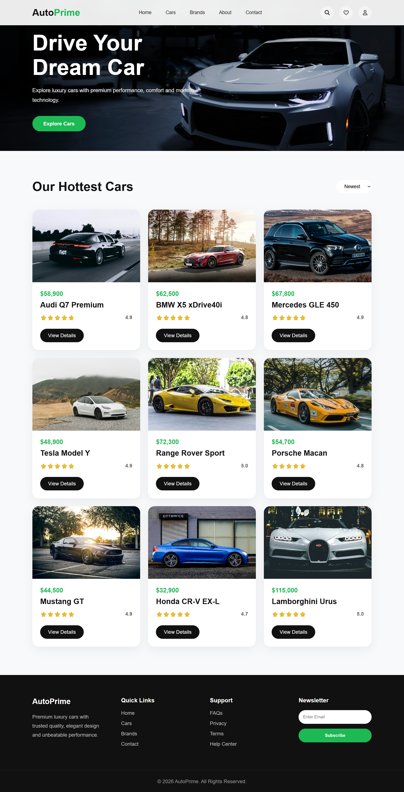
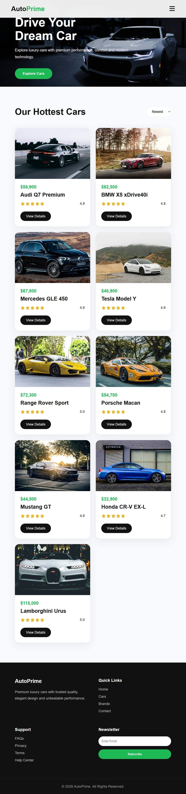
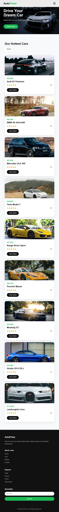

# 🚗 AutoPrime

AutoPrime is a modern and responsive luxury car showcase website built with **HTML5 and CSS3**.  
The project focuses on a clean automotive design, responsive layouts, smooth hover effects, and a mobile-friendly navigation menu.

## ✨ Features

- 🏎️ Premium luxury car landing page
- 📱 Fully responsive design
- 🧭 Fixed glass-effect navigation header
- 🍔 CSS-only mobile hamburger menu
- 🔍 Search, heart, and user icons using Font Awesome
- 🌄 Full-screen hero section with background image
- 🚘 Responsive car card grid
- ⭐ Car ratings and pricing
- 🎨 Modern hover animations
- 📋 Car category filter-style dropdown
- 📧 Newsletter subscription section
- 🦶 Responsive footer
- 📐 Media queries for desktop, tablet, and mobile screens

## 🛠️ Technologies Used

- **HTML5**
- **CSS3**
- **CSS Grid**
- **CSS Flexbox**
- **CSS Media Queries**
- **CSS Transitions & Transforms**
- **Font Awesome 6.6.0**

## 📂 Project Structure

```text
AutoPrime/
│
├── index.html
├── css/
│   ├── style.css
│   └── media.css
│
├── images/
│   ├── hero.jpeg
│   ├── car-1.jpeg
│   └── ...
│
├── output/
│   ├── desktop.png
│   ├── tablet.png
│   ├── mobile.png
│   └── small-LessThan-480px-Preview.png
│
└── README.md
```

## 🎯 Main Sections

### 1. Header

The header contains:

- AutoPrime logo
- Home
- Cars
- Brands
- About
- Contact
- Search icon
- Wishlist icon
- User icon
- Responsive hamburger menu

The header uses a fixed position with a glassmorphism-style background.

### 2. Hero Section

The hero section introduces the website with:

> **Drive Your Dream Car**

It also includes a short description and an **Explore Cars** button.

The hero background uses a luxury car image with a dark overlay to improve text readability.

### 3. Our Hottest Cars

The car section displays nine vehicles in responsive cards.

Each card contains:

- Car image
- Price
- Car name
- Star rating
- Rating score
- View Details button

The desktop layout uses three columns and automatically changes according to screen size.

### 4. Footer

The footer contains four sections:

- AutoPrime description
- Quick Links
- Support
- Newsletter subscription

It also includes a copyright section.

## 📱 Responsive Design

The project uses CSS media queries at three main breakpoints:

| Screen Size | Layout |
|---|---|
| Above 992px | Desktop layout with 3 car columns |
| 992px and below | 2 car columns + mobile navigation |
| 768px and below | 1 car column |
| 480px and below | Mobile-optimized typography and spacing |

## 🎨 Design Highlights

The website uses a simple premium color palette:

- Primary: `#111111`
- Secondary: `#666666`
- Green Accent: `#1db954`
- White: `#ffffff`
- Light Background: `#f8f9fb`

Animations include:

- Card lift on hover
- Image zoom on hover
- Navigation underline animation
- Button hover effects
- Icon hover effects
- Smooth scrolling

## 🚀 How to Run

1. Download or clone the project.
2. Open the project folder in VS Code.
3. Make sure the `images` folder contains all required car images.
4. Open `index.html` in your browser.

You can also use the **Live Server** extension in VS Code for easier development.

## 📚 What I Learned

While building this project, I practiced:

- Semantic HTML structure
- CSS Flexbox
- CSS Grid
- Responsive web design
- Media queries
- Fixed navigation
- CSS-only hamburger menu
- Background images and overlays
- Hover animations
- CSS transitions and transforms
- Responsive card layouts
- Footer layouts
- Font Awesome icons

## 🔮 Future Improvements

Some features that can be added in the future:

- 🔎 Functional car search
- 🏷️ Working category filters
- ❤️ Wishlist functionality
- 👤 User login/signup
- 🚘 Individual car detail pages
- 📱 Mobile navigation improvements
- 🛒 Booking/test-drive functionality
- ⚡ JavaScript interactions
- ⚛️ React.js version
- 🗄️ Backend with Node.js, Express.js and MongoDB

---
### 📱 Responsive Previews (Optional)
| Desktop View | Tablet View |
| :---: | :---: |
|  |  |

---

### 📱 Responsive Previews (Optional)
| Mobile | small lassthan 480px |
| :---: | :---: |
|  |  |

---

## 📄 License

This project is licensed under the [MIT License](http://github.com/Heytiwari/MIT-Licence?tab=MIT-1-ov-file).

---

## 👨‍💻 Author

**Rajan Kumar Tiwari**

Frontend Developer | Aspiring Full Stack Developer

## ⭐ Project Status

**Status:** Completed Frontend Practice Project

This project was created for learning and practicing modern responsive web development.

---

## 📄 License

This project is licensed under the [MIT License](http://github.com/Heytiwari/MIT-Licence?tab=MIT-1-ov-file).

⭐ If you like this project, feel free to give it a star!
