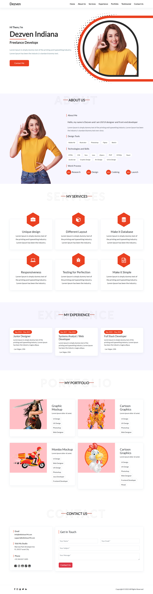
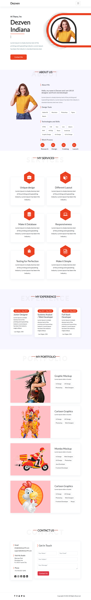


# 💼 Bootstrap Portfolio Website

A modern and responsive **Personal Portfolio Website** built using **HTML, CSS, Bootstrap, and Font Awesome**.

This project is designed to showcase a developer's profile, skills, services, work experience, portfolio projects, and contact information in a clean and professional layout.

## 🚀 Features

* Responsive navigation bar
* Hero/Banner section
* About Me section
* Design tools and technical skills
* Work process section
* Services section
* Professional experience section
* Portfolio showcase
* Contact information
* Contact form
* Social media links
* Responsive design for mobile and desktop
* CSS animations and typing effect
* Bootstrap grid and responsive utilities
* Font Awesome icons

## 🛠️ Technologies Used

* HTML5
* CSS3
* Bootstrap 5
* Font Awesome
* Google Fonts
* JavaScript / Bootstrap Bundle

## 📁 Project Structure

```text
bootstrap-final-exam/
│
└── Dezven/
    │
    ├── css/
    │   ├── bootstrap.min.css
    │   ├── font-awesome.css
    │   └── style.css
    │
    ├── images/
    │   ├── about-me.png
    │   ├── banner.png
    │   ├── dots.png
    │   ├── portfolio-01.jpg
    │   ├── portfolio-02.jpg
    │   ├── portfolio-03.jpg
    │   ├── portfolio-04.jpg
    │   ├── testimonial-1.jpg
    │   ├── testimonial-2.jpg
    │   └── testimonial-3.jpg
    │
    ├── js/
    │   └── bootstrap.bundle.min.js
    │
    └── index.html
```

## 📌 Website Sections

### 🏠 Home

The home section contains:

* Developer introduction
* Name and profession
* Short description
* Contact button
* Profile/banner image

### 👨‍💻 About Us

The About section provides information about the developer along with:

* Design tools
* Technologies and skills
* Work process

The listed technologies include HTML, CSS, SCSS, LESS, jQuery, PHP, MySQL, React, JavaScript, Graphic Design, and UI/UX Design.

### 💻 Services

The website provides multiple services, including:

* Unique Design
* Different Layout
* Database Development
* Responsive Design
* Testing
* Simple and Clean Development

### 📈 Experience

The Experience section displays professional roles and timelines, including:

* Junior Designer
* Systems Analyst / Web Developer
* Full Stack Developer

### 🎨 Portfolio

The Portfolio section showcases different projects with images, descriptions, and technology/design tags.

Portfolio items include:

* Graphic Mockup
* Cartoon Graphics
* Mombo Mockup
* Cartoon Graphics

### 📞 Contact

The Contact section includes:

* Email information
* Studio/location information
* Phone number
* Social media links
* Contact form

Users can enter:

* Name
* Email
* Subject
* Message

### 🦶 Footer

The footer contains social media icons and copyright information.

## 🎨 Design

The website uses a clean portfolio design with:

* White background
* Light grey sections
* Orange accent color
* Rounded cards
* Box shadows
* Responsive layouts
* Modern typography

The custom stylesheet also includes responsive media queries for smaller screens.

## 📱 Responsive Design

The website is built using Bootstrap's responsive grid system and custom CSS media queries.

It adapts to:

* Desktop
* Laptop
* Tablet
* Mobile devices

The navigation menu and content layouts adjust automatically on smaller screens.

## ⚙️ Installation

1. Download or clone the project.

2. Open the project folder.

3. Make sure the following folders are present:

```text
css/
images/
js/
```

4. Open `index.html` in your browser.

No server or database setup is required for the basic frontend version.

## 🌐 External Resources

The project uses external resources such as:

* Bootstrap
* Font Awesome
* Google Fonts

Bootstrap and Font Awesome are included in the HTML file along with the local CSS files.

## ✨ CSS Animations

The website includes custom CSS animations, including:

* Rotating decorative dots
* Typing/cursor animation
* Responsive styling

The banner decorative element uses a continuous rotation animation.

### Desktop


### 📱 Responsive Previews (Optional)
| Tablet | Mobile |
| :---: | :---: |
|  |  |

## 🎥 Project Video


## 👤 Credits

This project is based on a portfolio website design and has been customized for frontend development practice.

## 📜 License

This repository contains a `LICENSE` file. Please review the license
included with the project before redistributing or using the original
template commercially.
