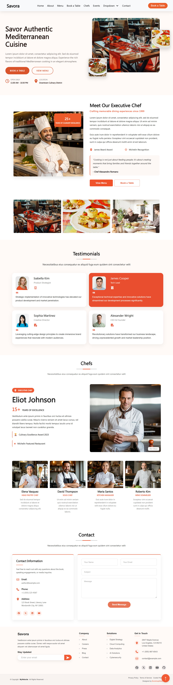

# 🍽️ Savora — Restaurant Website

A modern and elegant **restaurant website** built using **HTML5 and CSS3**.
This project is a frontend practice project inspired by a modern restaurant website design, featuring a clean layout, responsive sections, interactive hover effects, dropdown menus, chef profiles, testimonials, contact form, and footer.

> ⚠️ **Note:** This is a learning-based frontend project created for practice and educational purposes.

---

## 🌐 Project Overview

**Savora** is a restaurant-themed website designed to provide a professional and attractive online presence for a restaurant.

The website includes multiple sections such as:

* Navigation Bar
* Dropdown Menu
* Hero Section
* Restaurant Introduction
* Executive Chef Section
* Dining Experience Cards
* Testimonials
* Chefs Section
* Contact Section
* Contact Form
* Footer
* Back to Top Button

The project focuses on practicing **HTML structure, CSS layouts, positioning, hover effects, animations, cards, forms, and responsive-friendly design concepts**.

---

## ✨ Features

### 🧭 Navigation Bar

* Savora restaurant logo
* Home
* About
* Menu
* Book a Table
* Chefs
* Events
* Dropdown menu
* Deep dropdown menu
* Contact
* Book a Table button

### 🍴 Hero Section

* Large restaurant heading
* Restaurant description
* Book a Table button
* View Menu button
* Opening hours
* Restaurant location
* Main restaurant image
* Floating food cards
* CSS floating animations

### 👨‍🍳 Executive Chef Section

* Chef image
* 25+ years experience badge
* Chef introduction
* Awards
* Michelin recognition
* Chef quote
* View Menu button
* Book a Table button

### 🍷 Dining Experience

Three attractive image cards:

* Elegant Dining
* Signature Cuisine
* Curated Wine

Each card includes:

* Image zoom effect
* Dark overlay
* Text animation
* Hover interaction

### 💬 Testimonials

The testimonials section contains:

* Customer profile images
* Customer names
* Job titles
* Company/industry icons
* Quote icons
* Customer reviews
* Active testimonial card
* Hover animation

### 👨‍🍳 Chefs Section

Includes:

* Featured Executive Chef
* Chef experience
* Chef awards
* Michelin recognition
* Large chef image
* Additional chef cards

Chef profiles include:

* Elena Vasquez
* David Thompson
* Maria Santos
* Roberto Kim

### 📞 Contact Section

Includes:

* Contact information
* Email
* Phone
* Address
* Social media icons
* Name input
* Email input
* Subject input
* Message textarea
* Send Message button

### 🦶 Footer

The footer contains:

* Savora introduction
* Newsletter subscription
* Company links
* Solutions links
* Contact information
* Social media icons
* Privacy Policy
* Terms of Service
* Cookie Policy
* Copyright information
* Back to top button

---

## 🛠️ Technologies Used

| Technology    | Purpose                    |
| ------------- | -------------------------- |
| HTML5         | Website structure          |
| CSS3          | Styling and layout         |
| Font Awesome  | Icons                      |
| CSS Animation | Floating and hover effects |
| CSS Grid      | Section layouts            |
| CSS Flexbox   | Alignment and navigation   |
| Custom Font   | Segoe UI font              |

---

## 📁 Project Structure

```text
Savora/
│
├── index.html
│
├── css/
│   └── style.css
│
├── assets/
│   └── fonts/
│       └── Segoe UI.ttf
│
└── README.md
```

---

## 🎨 Main Design Features

### CSS Flexbox

Flexbox is used for:

* Navigation
* Buttons
* Chef information
* Contact details
* Footer elements
* Social icons

### CSS Grid

CSS Grid is used for:

* Chef section
* Testimonials
* Dining cards
* Contact layout
* Footer columns

### Hover Effects

The project includes different hover effects such as:

* Button color changes
* Image zoom
* Card movement
* Dropdown menus
* Social icon effects
* Navigation color changes

### CSS Animations

Floating food cards use CSS `@keyframes` animations to create a smooth floating effect.

---

## 🖼️ Project Preview

Add your project screenshot here:





---

## 🚀 How to Run

1. Download or clone this repository.

2. Open the project folder in **VS Code**.

3. Make sure the project structure is maintained.

4. Open `index.html`.

5. Run the project using **Live Server**.

---

## 📚 What I Learned

While creating this project, I practiced:

* HTML5 semantic structure
* CSS3 styling
* CSS Flexbox
* CSS Grid
* Absolute and relative positioning
* Fixed navigation
* Dropdown menus
* Deep dropdown menus
* CSS transitions
* CSS animations
* Image hover effects
* Cards design
* Forms
* Footer layouts
* Font Awesome icons
* Custom fonts using `@font-face`
* Responsive-friendly layouts
* Website section organization

---

## 🎯 Purpose of This Project

This project was created as part of my **frontend development learning journey**.

The main goal was to improve my understanding of:

**HTML + CSS + Layout + Animation + UI Design**

and to build a complete multi-section website from scratch for practical experience.

---

## 🔮 Future Improvements

Some features that can be added in the future:

* Fully responsive mobile design
* JavaScript mobile navigation
* Functional table booking form
* Form validation
* Restaurant menu page
* Food ordering functionality
* Image gallery
* Online reservation system
* Backend integration
* Database integration
* React.js version

---

## 👨‍💻 Author

**Rajan Kumar Tiwari**

Frontend Developer | Aspiring Full Stack Developer

### Skills

* HTML5
* CSS3
* JavaScript
* Bootstrap
* Git
* GitHub

---

## ⭐ Learning Project

If you like this project, feel free to ⭐ the repository.

**Built with HTML & CSS ❤️**

> **Believe in Yourself & Never Give Up.**
