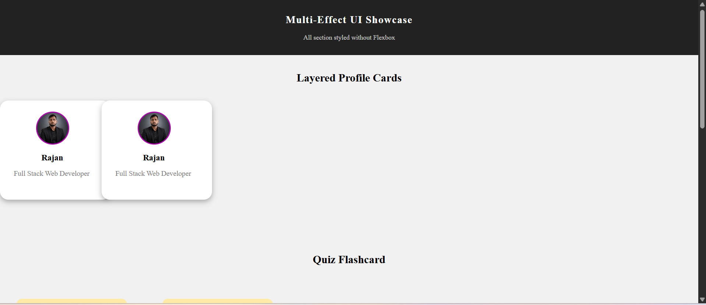
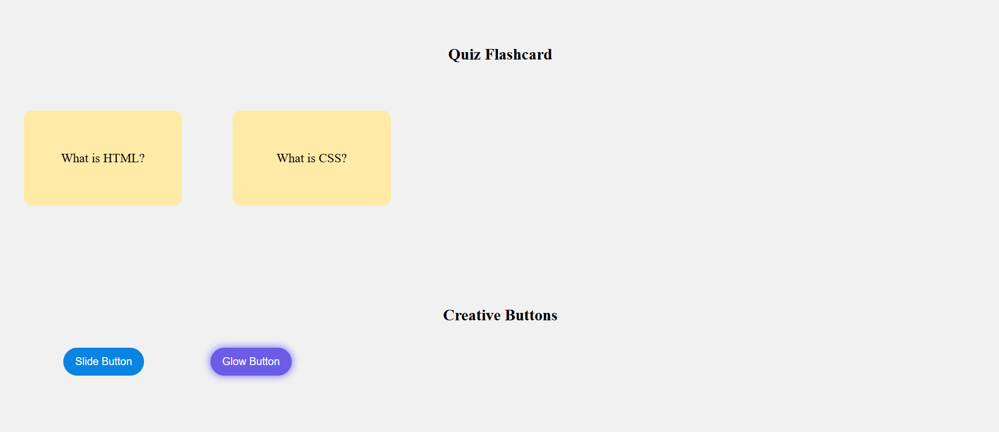
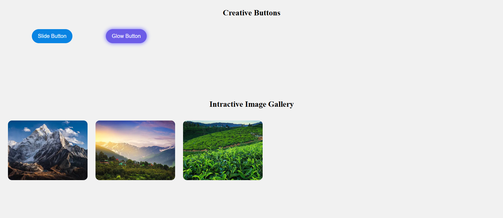

# 🎨 Multi-Effect UI Showcase

A modern HTML and CSS project demonstrating multiple creative UI effects without using **Flexbox**. This project is designed to practice CSS animations, transitions, hover effects, and responsive layouts.

---

## 🚀 Features

- 👤 Layered Profile Cards
- 🔄 Quiz Flashcards with Flip Effect
- 🎯 Creative Buttons
  - Slide Hover Button
  - Glow Effect Button
- 🖼️ Interactive Image Gallery
- 🎨 Pure HTML & CSS
- 📱 Responsive Design
- ❌ No Flexbox Used

---

## 📂 Project Structure

```
Labwork 11.4/
│
├── index.html
├── css/
│     └── style.css
├── images/
│     └── rajan.png
└── README.md
```

---

## 🛠️ Technologies Used

- HTML5
- CSS3
- CSS Animations
- CSS Transitions
- CSS Transform
- Hover Effects

---

## 📸 Sections

### 👤 Layered Profile Cards
Displays stylish profile cards with layered design.

### 🔄 Quiz Flashcards
Interactive flashcards that reveal the answer using a flip animation.

### 🎯 Creative Buttons
Includes:
- Slide Button
- Glow Button

### 🖼️ Interactive Image Gallery
A simple image gallery with hover effects.

---

## 🎯 Learning Objectives

This project helps you practice:

- Positioning
- Pseudo-elements (`::before`)
- Hover Effects
- CSS Transitions
- CSS Transform
- Overflow
- Border Radius
- Animation Basics
- UI Design Principles

---

## ▶️ How to Run

1. Download or clone the repository.

```bash
git clone https://github.com/Heytiwari/HTML/tree/main/labwork%20project/labwork%2011.4
```

2. Open the project folder.

3. Open `index.html` in your browser.

---

## 📸 Screenshots

<p align="left">
  <a href="output/1.png"></a>
  <a href="output/2.png"></a>
</p>

<p align="left">
  <a href="output/3.png"></a>
</p>
---

## 🌟 Future Improvements

- Dark Mode
- Responsive Navigation
- More Button Animations
- More Card Designs
- JavaScript Interactions
- Better Mobile Optimization

---

## 👨‍💻 Author

**Rajan Kumar Tiwari**

Frontend Developer | Aspiring Full Stack Developer

- GitHub: https://github.com/Heytiwari

---

## 📄 License

This project is open-source and available under the MIT License.

---

⭐ If you like this project, don't forget to give it a **Star** on GitHub!