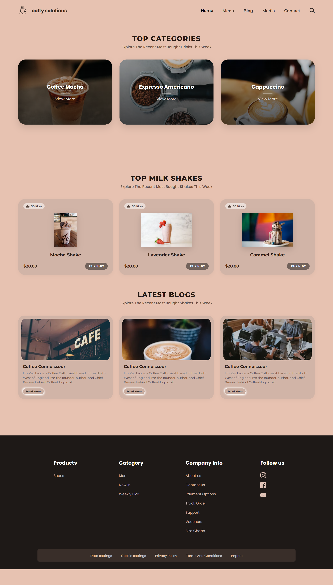
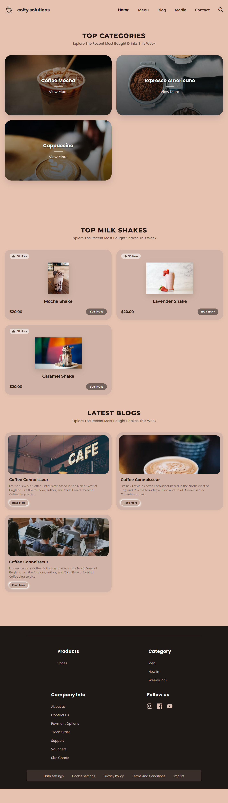
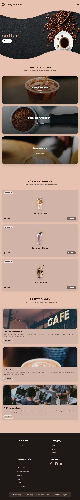

# ☕ Cofty Solutions - Freshly Roasted Coffee & Café

A modern, responsive, and visually appealing landing page built for **Cofty Solutions**, a modern coffee shop brand. The design features a warm peach/coffee aesthetic, custom SVG branding, product showcases, interactive category and blog grids, and a comprehensive footer.

---

## 📸 Overview & Features

- **Custom Brand Identity:** Handcrafted vector SVG coffee cup logo and typography pairing.
- **Responsive Navigation:** Smooth scroll navigation with desktop and mobile menu support.
- **Top Categories Showcase:** High-impact overlay cards with hover zoom transitions for featured brews (Coffee Mocha, Espresso Americano, Cappuccino).
- **Product Storefront Grid:** Dedicated shake product cards featuring like counters, pricing, and "Buy Now" CTAs.
- **Curated Blog Section:** Clean editorial preview cards with featured images and snippet excerpts.
- **Multi-column Footer:** Complete navigation with quick links, social media integration, and legal compliance bars.
- **Fully Responsive:** Custom media queries tailored for desktops, tablets ($<992\text{px}$), mobile devices ($<768\text{px}$), and compact screens ($<480\text{px}$).

---

## 🛠️ Tech Stack

| Technology | Description |
| :--- | :--- |
| **HTML5** | Semantic structure and custom inline SVGs |
| **CSS3** | Modern CSS variables, Flexbox, CSS Grid, and custom animations |
| **Google Fonts** | `Montserrat` (Headings/Body) & `Poppins` (Subtitles/Accents) |
| **FontAwesome 6.4** | Icons for search and mobile menu toggling |

---

## 📁 Suggested Project Structure

To organize the provided HTML and CSS files, set up your folder structure as follows:

```text
cofty-solutions/
│
├── index.html              # Main HTML markup
├── css/
│   ├── style.css           # Core styling & design tokens
│   └── media.css           # Responsive breakpoints & mobile styles
├── assets/
│   └── images/             # Local images (optional replacement for URLs)
└── README.md               # Project documentation
```

---

## 🚀 Getting Started

### 1. Clone or Download the Repository
```bash
git clone https://github.com/Heytiwari/html.git
```

### 2. Run the Project
Since this is a static website, you don't need any complex build steps. You can open `index.html` directly in your browser:

- **Option A (Direct):** Double-click `index.html` or open it with your favorite browser.
- **Option B (VS Code Live Server):** Right-click `index.html` in VS Code and select **"Open with Live 
---

## 🎨 Design System & Color Palette

The project uses custom CSS variables defined in `:root`:

| Token | Hex Value | Usage |
| :--- | :--- | :--- |
| `--bg-peach` | `#e7c2b1` | Primary background color |
| `--bg-peach-light` | `#ecd1c3` | Elevated card highlights |
| `--dark-slate` | `#1d1f20` | Dark elements & high-contrast titles |
| `--text-dark` | `#2c221e` | Primary body typography |
| `--accent-color` | `#d69f7e` | Accent lines, hover states, and details |
| `--font-main` | `'Montserrat', sans-serif` | Global primary typeface |
| `--font-sub` | `'Poppins', sans-serif` | Titles, subtitles, and accents |

---

## 📱 Responsive Breakpoints

- **Desktop ($> 992\text{px}$):** Full 3-column layout for categories, product grids, and a 4-column footer.
- **Tablets ($\le 992\text{px}$):** 2-column layout for cards and adapted footer spacing.
- **Mobile ($\le 768\text{px}$):** Single-column stacked layout, hamburger menu activation.
- **Small Screens ($\le 480\text{px}$):** Compact padding, smaller typography scaling, and streamlined card sizing.

---

## 💡 Planned Enhancements

- [ ] Add JavaScript toggle functionality for the mobile hamburger drawer menu.
- [ ] Connect the search icon button to an interactive search modal.
- [ ] Integrate a shopping cart drawer or checkout modal on clicking **"Buy Now"**.
- [ ] Add category filter tabs (e.g., *Hot Coffee*, *Iced Drinks*, *Pastries*).

---

### 📱 Responsive Previews (Optional)
| Desktop View | Tablet View |
| :---: | :---: |
|  |  |  |  |

---

### 📱 Responsive Previews (Optional)
| Mobile | small lassthan 480px |
| :---: | :---: |
|  |  |

---
### Project video

https://github.com/user-attachments/assets/b69cec9a-4203-4ea0-b6a9-35916ccea46d

---

## 📄 License

This project is licensed under the [MIT License](http://github.com/Heytiwari/MIT-Licence?tab=MIT-1-ov-file).
