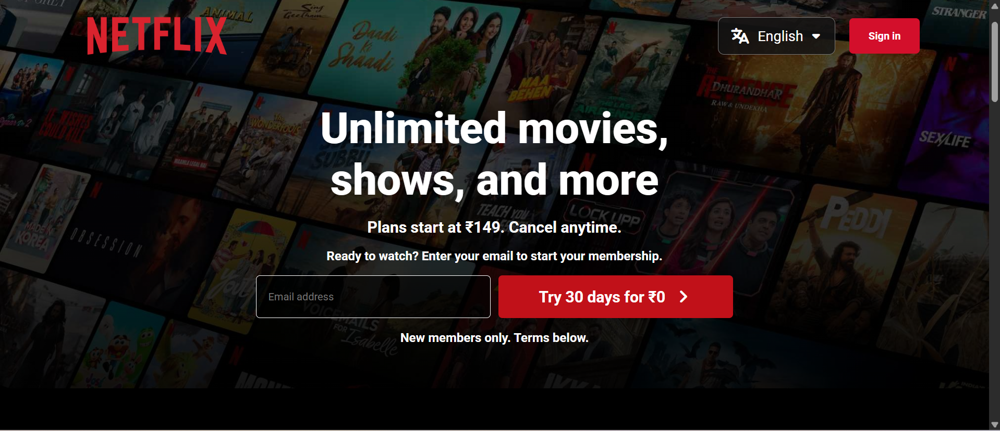
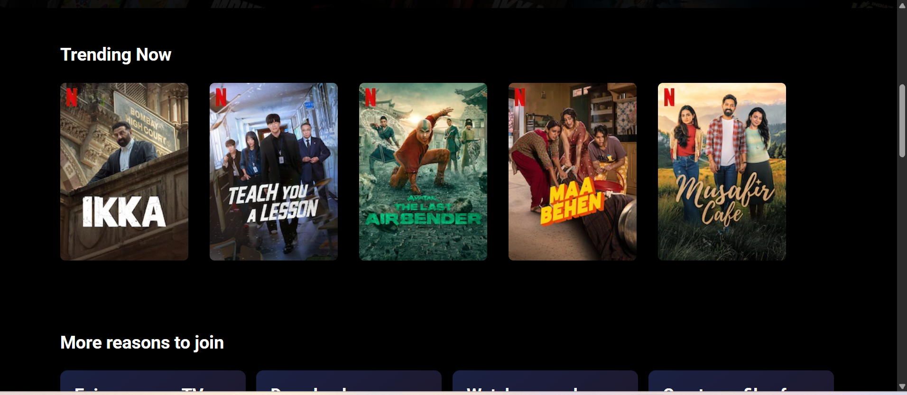
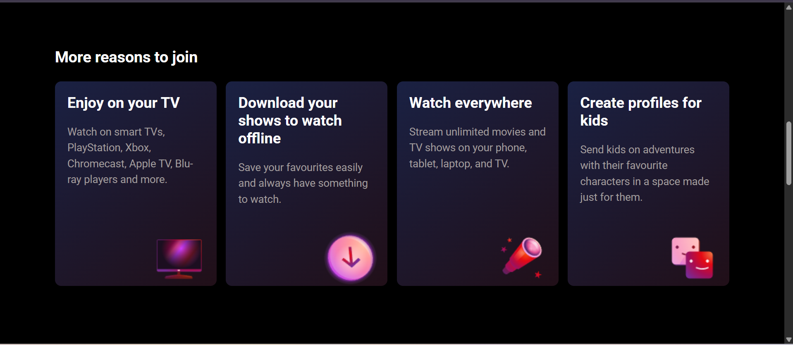
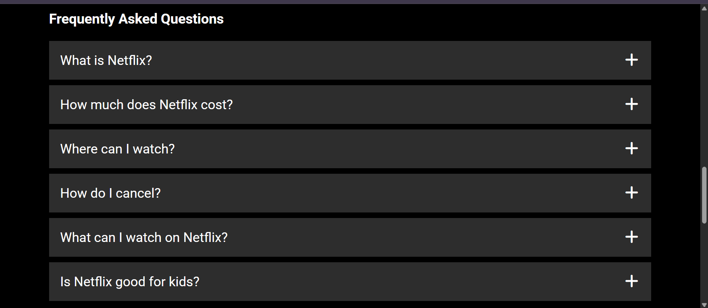
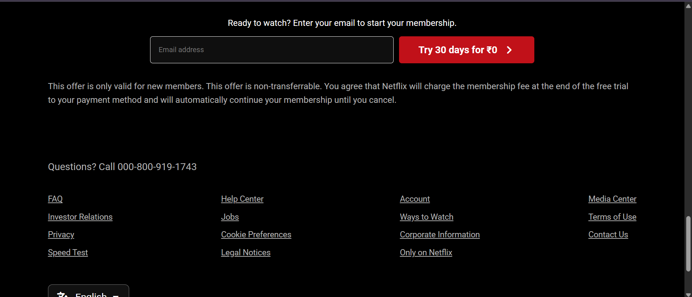

# 🎬 Netflix India Landing Page Clone

A modern **Netflix India Landing Page Clone** built using **HTML5 and CSS3**.  
This project recreates a Netflix-inspired landing page with a promotional header, navigation bar, hero section, trending content, membership benefits, FAQ section, email signup forms, and footer.

> ⚠️ **Note:** This is a frontend practice project created for educational purposes. It is not affiliated with or endorsed by Netflix.

---

## 🌐 Live Preview

🚀 **Live Demo:** Add your deployed project link here.

```text
https://your-project.vercel.app
```

---

## 📸 Screenshots

### 🏠  Home/Trending Now

<p>
 

</p>

### ⭐  More Reasons to Join/Frequently Asked Questions
<p>
 

</p>

### 📞 Footer 
<p>

</p>

## ✨ Features

- 🎬 Netflix-inspired landing page design
- 🎁 Promotional header with gradient background
- 🧭 Navigation bar with Netflix logo
- 🌐 Language selection dropdown
- 🔐 Sign In button
- 🖼️ Hero section with background image and dark overlay
- 📧 Email signup forms
- 🎞️ Trending movies/shows section
- 🔥 Hover zoom effect on trending cards
- ⭐ More reasons to join section
- 📺 TV, download, streaming and kids profile cards
- ❓ Frequently Asked Questions section
- ➕ FAQ buttons with Font Awesome icons
- 📞 Footer with useful links
- 🌐 Footer language selector
- ✨ CSS hover effects and transitions
- 🎨 Netflix-inspired dark theme
- 🧩 CSS Flexbox based layout

---

## 🛠️ Technologies Used

- HTML5
- CSS3
- CSS Flexbox
- CSS Gradients
- CSS Hover Effects
- CSS Transitions
- Font Awesome
- Google Fonts

---

## 📂 Project Structure

```text
netflix-homepage/
│
├── index.html
│
├── css/
│   └── style.css
│
├── assets/
│   └── images/
│       ├── logo.png
│       ├── bgimg.jpg
│       ├── ikka.webp
│       ├── teach.webp
│       ├── 3.webp
│       ├── 4.webp
│       ├── c21.png
│       ├── c22.png
│       ├── c23.png
│       └── c24.png
│
├── screenshots/
│   ├── home.png
│   ├── trending.png
│   ├── more-reason.png
│   ├── faq.png
│   └── footer.png
│
└── README.md
```

---

## 🚀 Getting Started

### Clone the Repository

```bash
git clone https://github.com/Heytiwari/HTML/tree/main/netflix-homepage
```


### Run the Project

Open `index.html` directly in your browser.

---

## 🧩 Sections Included

### 🏠 Home
- Promotional header
- Netflix logo
- Language selector
- Sign In button
- Hero banner
- Email signup form

### 🎞️ Trending Now
- Movie/show poster cards
- Hover zoom effect
- Responsive-friendly card layout

### ⭐ More Reasons to Join
- Enjoy on your TV
- Download your shows to watch offline
- Watch everywhere
- Create profiles for kids

### ❓ FAQ
- What is Netflix?
- How much does Netflix cost?
- Where can I watch?
- How do I cancel?
- What can I watch on Netflix?
- Is Netflix good for kids?

### 📞 Footer
- Customer support information
- Useful links
- Language selector
- Netflix India
- reCAPTCHA information

---

## 🎯 Learning Outcomes

This project helped me practice:

- Semantic HTML5
- CSS Flexbox
- CSS positioning
- Background images
- Linear gradients
- Hover effects
- CSS transitions
- Dropdown menus
- Card layouts
- Form styling
- Navigation design
- Footer design
- Responsive web design
- UI cloning techniques

---

## 🔮 Future Improvements

- [ ] JavaScript FAQ expand/collapse
- [ ] Functional language switching
- [ ] Email validation
- [ ] Responsive mobile navigation
- [ ] Movie carousel/slider
- [ ] Login page
- [ ] Signup page
- [ ] Search functionality
- [ ] Netflix API integration
- [ ] Dynamic movie data
- [ ] Improved mobile responsiveness

---

## 👨‍💻 Author

**Rajan Kumar Tiwari**

**Frontend Developer | Aspiring Full Stack Developer**

---

## ⭐ Support

If you like this project, please consider giving the repository a ⭐ on GitHub.

---

## 📄 Disclaimer

This project is created **strictly for educational and practice purposes**.

Netflix and its associated logos, names, and branding are trademarks of **Netflix, Inc.**

This project is an independent frontend clone and is **not affiliated with Netflix**.

---

### ❤️ Built with HTML & CSS

**Made with ❤️ by Rajan Kumar Tiwari**
